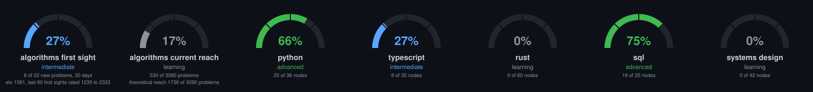

This is an amalgamation of leetcode problems, as well as several language drills.

<!-- GAUGES -->

<!-- /GAUGES -->

## Leetcode sitecustomize, harness and helpers

Moved to [HARNESS.md](HARNESS.md).
